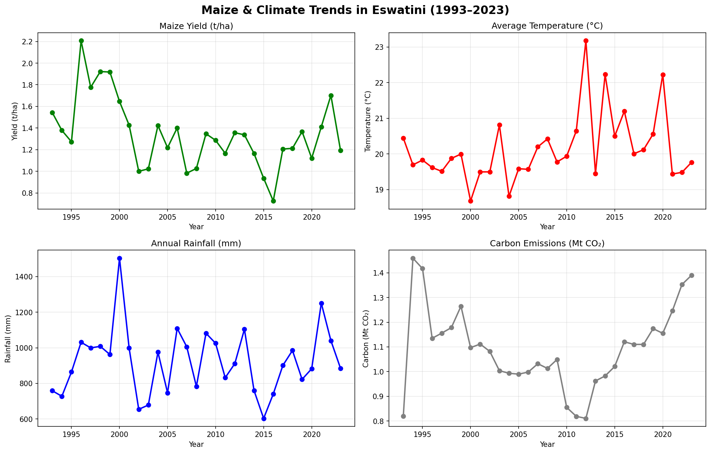
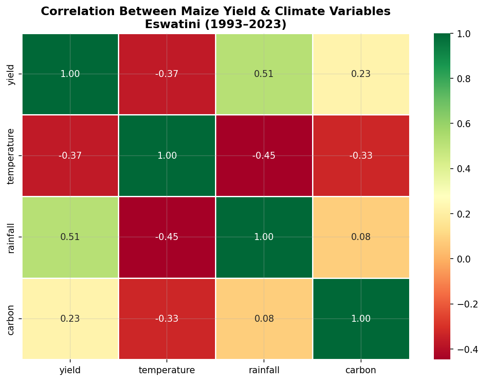

# 🌽 Effects of Climate Change on Maize Yield in Eswatini (1993–2023)


## 📌 Project Overview
This project investigates how climate change variables  temperature, rainfall, 
and carbon emissions  have affected maize yield in Eswatini over a 30-year period 
(1993–2023). The analysis combines statistical methods, machine learning, and 
interactive visualizations to uncover meaningful patterns and forecast future yield trends.

## 🌍 Background & Context
Maize (*Zea mays*) is the staple food crop of Eswatini, forming the foundation 
of both household food security and the national agricultural economy. The majority 
of maize production in Eswatini is carried out by **smallholder farmers** who depend 
almost entirely on **rain-fed agriculture**, with minimal access to irrigation 
infrastructure.

This heavy dependence on rainfall makes Eswatini's maize sector extremely 
vulnerable to climate variability. Rising temperatures, erratic rainfall patterns, 
and prolonged droughts — increasingly linked to climate change — pose a serious 
threat to yields and by extension, the food security of the population.

The **2015/2016 El Niño drought** serves as a stark example, pushing maize yield 
to its lowest recorded level of **0.73 t/ha** in 2016 — well below the national 
average. Understanding how climate variables drive yield variation is therefore 
not just an academic exercise but a **critical policy and planning need** for 
Eswatini's agricultural sector.

---

## 🎯 Objectives
- Analyze trends in maize yield alongside key climate variables
- Measure the strength of relationships between climate and yield
- Build predictive models to explain yield variation
- Forecast maize yield through 2031 based on historical climate trends

---

## 📂 Project Structure
├── data/
│   ├── raw/                  # Original Excel dataset
│   └── processed/            # Cleaned CSV dataset
├── visuals/
│   ├── trend_plots.png
│   ├── correlation_heatmap.png
│   ├── regression_actual_vs_predicted.png
│   ├── scatter_plots.png
│   ├── decade_averages.png
│   ├── rf_actual_vs_predicted.png
│   ├── feature_importance.png
│   ├── yield_forecast.png
│   └── interactive_dashboard.html
├── hello.py                  # Main analysis script
└── README.md

---

## 📊 Dataset
| Variable | Description | Unit |
|----------|-------------|------|
| Year | 1993 to 2023 | — |
| Production | Total maize produced | Metric tonnes |
| Area | Land under maize cultivation | Hectares |
| Yield | Maize yield per hectare | t/ha |
| Rainfall | Annual rainfall | mm |
| Temperature | Average annual temperature | °C |
| Carbon | Carbon emissions | Mt CO₂ |

---

## 🔧 Tools & Libraries
- **Python** — pandas, numpy, matplotlib, seaborn, scikit-learn, plotly

---

## 📈 Methodology
1. **Data Cleaning** — standardized column names, verified data types, checked for missing values
2. **Exploratory Data Analysis** — time series trends for all variables
3. **Correlation Analysis** — measured relationships between climate variables and yield
4. **Linear Regression** — modelled yield as a function of climate variables
5. **Random Forest** — applied ensemble ML model and compared performance
6. **Feature Importance** — identified which climate variable drives yield most
7. **Forecasting** — projected yield through 2031 using historical climate trends

## 📸 Project Visuals

### Maize & Climate Trends


### Correlation Heatmap


---

## 🔑 Key Findings
- 🌧️ **Rainfall is the strongest driver** of maize yield (correlation: +0.51)
- 🌡️ **Rising temperatures negatively affect yield** (correlation: -0.37)
- 📉 **2016 recorded the lowest yield** (0.73 t/ha) coinciding with the severe El Niño drought
- 📈 **1996 recorded the highest yield** (2.21 t/ha)
- 🤖 Climate variables explain **30.8% of yield variation** — remaining variation attributed to farming practices, soil quality and policy factors
- 🔮 **Yield is projected to decline gradually through 2031** if current climate trends continue

---

## ⚠️ Model Performance
| Model | R² Score | RMSE |
|-------|----------|------|
| Linear Regression | 30.8% | 0.2618 t/ha |
| Random Forest | 22.7% | 0.2594 t/ha |

> Linear Regression outperformed Random Forest due to the limited dataset size 
> of 31 observations, which is insufficient for ensemble methods to generalise effectively.

---

## 🔮 Yield Forecast (2024–2031)
| Year | Temp (°C) | Rainfall (mm) | Forecast Yield (t/ha) |
|------|-----------|---------------|----------------------|
| 2024 | 20.69 | 927.29 | 1.3281 |
| 2025 | 20.73 | 927.53 | 1.3270 |
| 2026 | 20.76 | 927.76 | 1.3259 |
| 2027 | 20.80 | 927.99 | 1.3248 |
| 2028 | 20.83 | 928.22 | 1.3237 |
| 2029 | 20.87 | 928.46 | 1.3227 |
| 2030 | 20.90 | 928.69 | 1.3216 |
| 2031 | 20.93 | 928.92 | 1.3205 |

> ⚠️ Forecasts assume historical climate trends continue. Uncertainty increases beyond 2028.

---
## 📖 The Story This Data Tells
Over 30 years, Eswatini's maize sector has faced a quietly worsening climate 
reality. Temperatures rose from **19.5°C in 1993 to over 23°C by 2023**, while 
rainfall has swung erratically between **427mm and 1031mm** across the same period.

The data tells a clear story:

> **When it rains well, Eswatini's smallholder farmers produce.**
> **When it doesn't, the country goes hungry.**

The best year on record was **1996 with a yield of 2.21 t/ha**, coinciding with 
one of the highest rainfall years of **1031mm** — nearly double the worst recorded 
rainfall. By contrast, **2016 recorded the lowest yield of just 0.73 t/ha**, 
driven by the devastating El Niño drought that slashed rainfall and pushed 
temperatures to extreme levels — leaving smallholder farmers with less than 
a third of the best harvest ever recorded.

The decade averages tell an equally concerning story — average yields have 
remained stubbornly low at around **1.35 t/ha**, well below the African 
average of 2 t/ha, reflecting the compounding pressure of rising temperatures 
and unreliable rainfall on rain-fed smallholder agriculture.

Looking ahead, the forecast is cautious but concerning. If current climate 
trends continue — temperatures projected to reach **20.93°C by 2031** with 
gradually stabilising rainfall — maize yield is projected to **decline from 
1.33 t/ha in 2024 to 1.32 t/ha by 2031.** While the decline appears gradual, 
for smallholder farmers already operating at subsistence level, even small 
yield reductions translate to significant food insecurity.

This analysis is a data-driven contribution to understanding that challenge — 
and a call for evidence-based agricultural policy in Eswatini.

## 💡 Recommendations
- Invest in **irrigation infrastructure** to reduce rain-fed dependency
- Promote **drought-resistant maize varieties** suited for rising temperatures
- Strengthen **early warning systems** tied to seasonal rainfall forecasts
- Conduct further research incorporating **soil quality and farming practice data**

---

## 👤 Author
**Your Name**
- 📧 mlandvothwala@gmail.com
- 💼 [LinkedIn](https://linkedin.com/in/mlandvo-inshiva-thwala)
- 🐙 [GitHub](https://github.com/iNshiva)

## 🚀 How to Run This Project

### Prerequisites
- Python 3.8+
- Git

### Steps
1. Clone the repository:
```bash
git clone https://github.com/iNshiva/maize-yield-climate-eswatini.git
```

2. Navigate to the project folder:
```bash
cd maize-yield-climate-eswatini
```

3. Install required libraries:
```bash
pip install -r requirements.txt
```

4. Run the analysis:
```bash
python hello.py
```

5. Open the interactive dashboard:

## 📜 License
This project is licensed under the MIT License.
